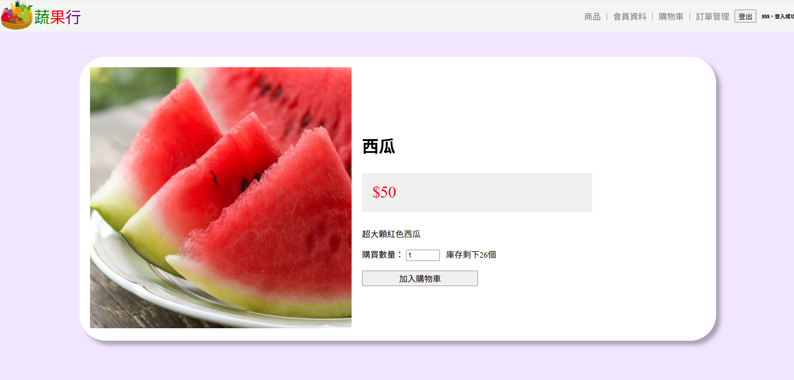
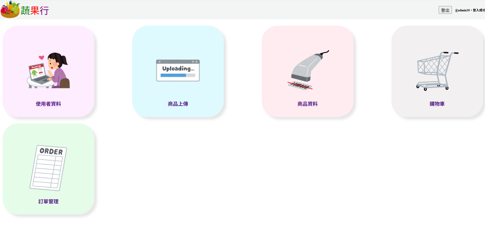

# PHP 與 MySQL 購物車系統

使用 **PHP** 與 **MySQL** 所製作的線上購物車系統，模擬電子商務網站之購物流程。系統區分為使用者與管理者兩種角色，使用者可進行會員註冊、會員登入、商品瀏覽、購物車管理及訂單建立；管理者則可透過後台介面進行商品新增、修改、刪除、上下架及訂單管理也可管理使用者帳號。整體系統透過 MySQL 資料庫管理會員、商品及訂單資料，實現完整的電子商務運作流程。

## 系統 Demo

### Demo 完整示範影片
⭐️ [**點我前往 YouTube 觀看完整購物車功能操作影片**](https://www.youtube.com/watch?v=wfp6QbuV_JA)

### 前台使用者商品與購物車畫面

### 後端管理系統

